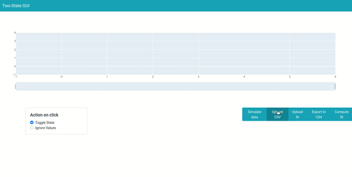

# Two-State GUI
A GUI for fitting two-state hidden Markov models on one-dimensional time series.

This user interface allows to:
- Visualize data and a fitted HMM
- Manually correct the fitted state of time intervals by simply clicking on the corresponding curve.
- Fit a HMM on the data.
- Export the results and summary statistics as CSV files.




## Installation
From a dedicated virtual environment, clone the package and install the requirements:
```bash
$ git clone https://github.com/rfayat/GUI_outlier_correction.git
$ cd GUI_outlier_correction
$ pip install -r requirements.txt
# Package for HMM fitting
$ pip install git+git://github.com/lindermanlab/ssm.git
```

## Running the app
From the cloned repository folder, run:
```bash
$ python -m two_state_gui.app
Dash is running on http://127.0.0.1:8050/

 * Serving Flask app 'app' (lazy loading)
 * Environment: production
   WARNING: This is a development server. Do not use it in a production deployment.
   Use a production WSGI server instead.
 * Debug mode: on
```
The app is now running and can be accessed by visiting the displayed address (http://127.0.0.1:8050/).

**Warning** The computer serving the app needs to be connected to the internet for loading the templates and graphical components.

**Warning** The app is by default run in debug mode (`debug` argument of `app.run_server` in [app.py](two_state_gui/app.py)) to make it easier to track bugs and should not be deployed in production as is. This is not an issue for running and using the app locally but if you wish to deploy the app on a server accessible by outside users, have look at the deployment instructions for doing so on [plotly dash's website](https://dash.plotly.com/deployment).

## Overview of the implementation
### Main code for the app ([app.py](two_state_gui/app.py))
This script contains all graphical components of the app, written using [plotly dash](https://plotly.com/dash/) in pure python. When run, this script also launches the server that can be used to access the app.

### File inputs and outputs ([file_io.py](two_state_gui/file_io.py))

Helper functions for importing data and HMM fits. Both data and fits must be stored as csv files with one column and no header. Fits must be stored as **a column of the states means** for each point of the data.

**Note:**
Import of excel (.xls) files is not supported for now but should be quite straightforward by modifying the `parse_content` function.

### Backend for the data ([data_handling.py](two_state_gui/data_handling.py))
[data_handling.py](two_state_gui/data_handling.py) defines `HMM_State_Handler`, a python class at the core of the app which allows to fit and store a Hidden Markov Model for a particular time series.

A fitted model is stored as a set of intervals each of them being allocated to a particular state. The main attributes of objects of this class are numpy array sufficient to obtain the fitted model, namely:

- `HMM_State_Handler.intervals_start` and `HMM_State_Handler.intervals_end`, the start and end indexes of each interval.
- `HMM_State_Handler.intervals_states`, the state allocated to each of the intervals.
- `HMM_State_Handler.intervals_states_corrected`, the state allocated to each of the intervals after potential post-hoc modifications by the user via the app.

States are stored as positive integers except for those that were ignored during the fit which are set to the value `-1`.

#### State corrections
Change of the state of an interval by the user are dealt with by `HMM_State_Handler.change_interval_state` and `HMM_State_Handler.change_interval_missing_status` which respectively increment a selected state's corrected state value and change the corrected state value of an interval to `-1` if it was a positive integer and to `0` if it was `-1`.

#### Summary exports
Summary DataFrames can be created and exported to csv to an output folder with the `HMM_State_Handler.export` method. For now, 5 DataFrames are exported:

- `df_data` (created using `HMM_State_Handler.to_dataframe`) a dataframe of same length as the input data, with columns corresponding to the time, the input data, the fitted and corrected HMM states and state mean for each timestamp.
- `df_intervals` (created using `HMM_State_Handler.to_intervals_dataframe`), a dataframe with as many rows as intervals of constant state in the fit and columns corresponding to the start and end indexes and times and duration of each interval, the corresponding fitted and corrected state and matching state mean.
- `df_summary`(created using `HMM_State_Handler.summary`). To compute the values of this dataframe, the continuous intervals of same corrected state are first merged. For instance if intervals *i* and *i+2* had state *0* while interval *i+1* had state *1* and the user corrected the state of interval *i+1* to *0*, the three intervals are now considered as only one with state *0*. Summary statistics about the data and duration of the corrected intervals (E.G. mean and std of the duration of intervals in state *i*) are then computed and saved.
- `df_fit` (created using `HMM_State_Handler.df_fit`) a single column of same length as the input data with the fitted mean of the fitted states. Ignored intervals (state `-1`) have a nan mean value.
- `df_fit_corrected` (created using `HMM_State_Handler.to_intervals_dataframe`), a single column of same length as the input data with the fitted mean of the fitted states after corrections by the user via the app.


### HMM handling and fit ([hmm.py](two_state_gui/hmm.py))
[hmm.py](two_state_gui/hmm.py) defines the classes `HMM` and `Gaussian` which are used for storing the fitted parameters and used as wrappers for the fitting pipelines. `HMM_State_Handler` inherits these functionalites `HMM`.

#### Fitting procedure and outlier intervals detection
When called with input data as argument, `HMM.fit_predict` runs the `fit_hmm` function and returns the predicted states for the data. The `fit_hmm` function is based on [Scott Linderman lab's ssm package](https://github.com/lindermanlab/ssm) and fits a simple Hidden Markov model with Gaussian emissions.

The pipeline includes an outlier detection pipeline to prevent short intervals of data with values very distant of the rest of the the time series to impact the fitted mean. This pipeline (run when the `detect_outliers` argument of `fit_hmm` is set to True) works as follows:

- A first fit of an Hidden Markov Model is performed on the data.
- The mean value of the data for each interval is computed.
- For each state, the median and quartiles of the means of the corresponding intervals are computed.
-  The input **inter-quartile-range factor** (`iqr_factor` argument) is then used to spread the inter-quartile range. Intervals whose mean falls outside the resulting range (i.e. outside of *[median - iqr_factor * (median - 25th percentile), median + iqr_factor * (75th percentile - median)]*) are treated as outliers and assigned to state -1.
- A new fit is performed, ignoring the outlier intervals.

### Data simulation ([simulation.py](two_state_gui/simulation.py))
Defines a `Data_Simulator` class which can be useful for generating fake data for debugging and testing the user interface.

## Bug report
If you find a bug, please [open an issue](https://github.com/rfayat/two_state_gui/issues) on the github repository and provide as much details as possible to replicate it (files used, outputs in the console or the dash application...).
